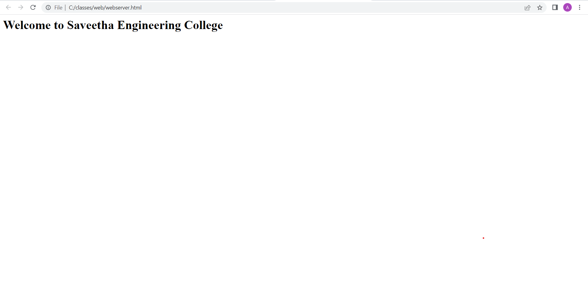

# Developing a Simple Webserver

# AIM:

Develop a webserver to display about top five web application development frameworks.
karthikeyan R 22009322

# DESIGN STEPS:

## Step 1:

HTML content creation is done

## Step 2:

Design of webserver workflow

## Step 3:

Implementation using Python code

## Step 4:

Serving the HTML pages.

## Step 5:

Testing the webserver

# PROGRAM:
```
from http.server import HTTPserver, baseHTTPRequestHandler


content = """
<html>
<head>
</head>
<body>
<h1>Welcome to Saveetha Engineering College</h1>
</body>
</html>
"""

class HelloHandler(baseHTTPRequestHandler):
    def do_GET(self):
    self.send_response(200)
    self.send_header('Content_type', 'text/html; charset=utf-8')
    self.end_headers()
    self.wfile.write(content.encode())


server_address = ('', 80)
httpd = HTTPserver(server_address,HelloHandler)
httpd.serve_forever()
```
### OUTPUT


# RESULT:

The program is executed succesfully
